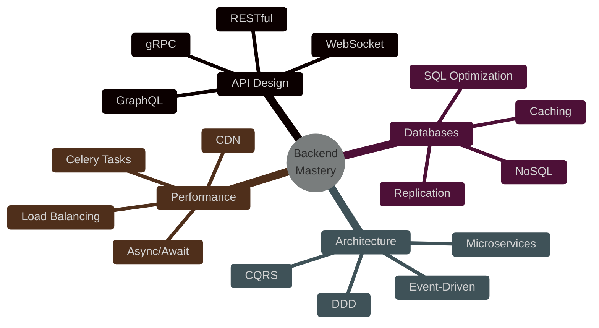
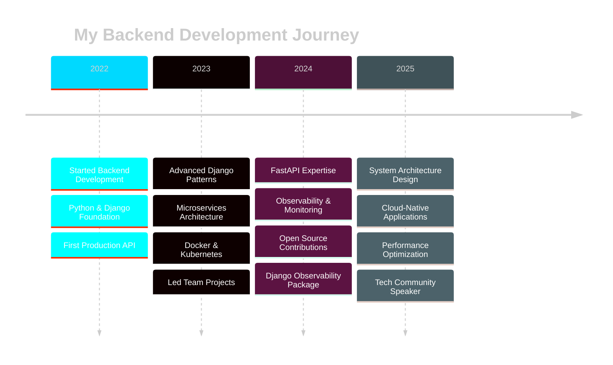
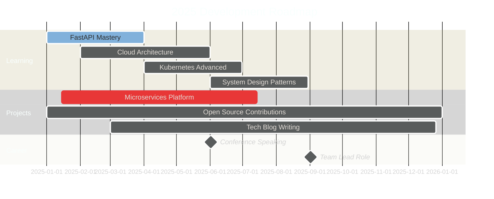

<div align="center">

<!-- Dynamic Header with Gradient -->


<!-- Animated Typing Effect -->
<a href="https://git.io/typing-svg"></a>

<br/>

<!-- Animated Badges -->
<p align="center">
  
  
  
</p>

<!-- Visitor Counter & Metrics -->
<p align="center">
  
  
  
</p>

</div>

<!-- Animated Divider -->


<!-- About Section with Advanced Layout -->
<div align="center">

##  About Me

</div>


```typescript
const mahdiGhadiri = {
    pronouns: "He" | "Him",
    location: "🌍 Iran",
    role: "Back-end Developer",
    company: "Leading Tech Company",
    
    code: {
        languages: ["Python", "SQL", "JavaScript", "TypeScript"],
        backend: ["Django", "FastAPI", "Flask", "DRF"],
        databases: ["PostgreSQL", "Redis", "MongoDB", "Elasticsearch"],
        devops: ["Docker", "Kubernetes", "Nginx", "CI/CD"],
        monitoring: ["Prometheus", "Grafana", "Loki", "Tempo"],
        messageQueues: ["RabbitMQ", "Celery", "Kafka"]
    },
    
    currentFocus: [
        "🎯 Mastering FastAPI & Async Programming",
        "☁️ Building Cloud-Native Microservices",
        "📊 Advanced System Observability",
        "🔐 Zero-Trust Security Architecture"
    ],
    
    architecture: {
        patterns: ["Microservices", "Event-Driven", "CQRS", "DDD"],
        principles: ["SOLID", "Clean Code", "DRY", "KISS"],
        testing: ["TDD", "Integration Testing", "Load Testing"]
    },
    
    hobbies: ["📸 Photography", "🏔️ Hiking", "📚 Tech Blogs", "🎮 Gaming"],
    
    funFact: "I debug with console.log... just kidding! 😄"
};
```

<br clear="right"/>

<div align="center">

### 🎯 What Drives Me

<table>
<tr>
<td align="center" width="33%">

**🚀 Innovation**

Pushing boundaries with<br/>cutting-edge tech

</td>
<td align="center" width="33%">

**🎨 Craftsmanship**

Writing beautiful,<br/>maintainable code

</td>
<td align="center" width="33%">

**🌱 Growth**

Continuous learning<br/>& improvement

</td>
</tr>
</table>

</div>

<!-- Animated Divider -->


<!-- Tech Stack Section with Hover Effects -->
<div align="center">

##  Technology Arsenal

</div>

<div align="center">

### 🐍 Backend & APIs

<p>


</p>

### 💾 Databases & Caching

<p>


</p>

### 🔧 DevOps & Cloud

<p>


</p>

### 📨 Message Brokers & Queues

<p>


</p>

### 📊 Monitoring & Observability

<p>


</p>

### 🛠️ Tools & Platforms

<p>


</p>

</div>

<!-- Animated Divider -->


<!-- Featured Projects Section -->
<div align="center">

##  Featured Projects

</div>

<div align="center">

<!-- Project 1: Django Observability -->
<a href="https://github.com/mahdighadiriii/django-observability">
  
</a>

<br/><br/>

### 🔍 Django Observability

<p align="center">
  <a href="https://pypi.org/project/django-observability/"></a>
  <a href="https://pypi.org/project/django-observability/"></a>
  <a href="https://github.com/mahdighadiriii/django-observability"></a>
  <a href="https://github.com/mahdighadiriii/django-observability"></a>
  <a href="https://github.com/mahdighadiriii/django-observability"></a>
</p>

```python
# Revolutionary Django monitoring middleware
✨ Features:
  • Real-time metrics tracking
  • Distributed tracing with OTLP
  • Query performance monitoring
  • Automatic span creation
  • Prometheus, Loki & Tempo integration
  • Production-ready & battle-tested
```

<details>
<summary><b>🚀 Key Highlights</b></summary>

- 📊 **Advanced Metrics**: Track request duration, query count, cache hits
- 🔍 **Distributed Tracing**: Full OTLP support with context propagation
- 📈 **Performance Insights**: Identify bottlenecks and optimize queries
- 🔌 **Easy Integration**: Drop-in middleware with minimal configuration
- 🎯 **Production Ready**: Used in high-traffic production environments

</details>

<br/>

<!-- Project 2: FullStack -->
<a href="https://github.com/mahdighadiriii/FullStack">
  
</a>

<br/><br/>

### 🌐 FullStack Web Application

<p align="center">
  <a href="https://github.com/mahdighadiriii/FullStack"></a>
  <a href="https://github.com/mahdighadiriii/FullStack"></a>
  <a href="https://github.com/mahdighadiriii/FullStack"></a>
</p>

```javascript
// Modern full-stack architecture
🛠️ Tech Stack:
  Backend  → Django REST Framework | JWT Auth | PostgreSQL
  Frontend → React 18 | Next.js 14 | Tailwind CSS
  Build    → Vite | Hot Module Replacement
  Deploy   → Docker | Nginx | CI/CD Ready
```

</div>

<!-- Animated Divider -->


<!-- GitHub Stats Section -->
<div align="center">

##  GitHub Analytics

<p align="center">
  
  
</p>

<p align="center">
  
  
</p>

<!-- Trophy Stats -->
<p align="center">
  
</p>

<!-- Contribution Snake -->
<picture>
  <source media="(prefers-color-scheme: dark)" srcset="https://raw.githubusercontent.com/mahdighadiriii/mahdighadiriii/output/github-contribution-grid-snake-dark.svg">
  <source media="(prefers-color-scheme: light)" srcset="https://raw.githubusercontent.com/mahdighadiriii/mahdighadiriii/output/github-contribution-grid-snake.svg">
  
</picture>

</div>

<!-- Animated Divider -->


<!-- Skills Matrix -->
<div align="center">

## 💪 Skills & Expertise

<table>
<tr>
<td valign="top" width="50%">

### 🎯 Core Competencies



</td>
<td valign="top" width="50%">

### 📊 Proficiency Levels

| Technology | Level | Years |
|:-----------|:-----:|:-----:|
| 🐍 Python |  | 3+ |
| 🎯 Django |  | 3+ |
| ⚡ FastAPI |  | 1+ |
| 🐘 PostgreSQL |  | 3+ |
| 🐳 Docker |  | 2+ |
| ☸️ Kubernetes |  | 1+ |
| 🔴 Redis |  | 2+ |
| 📊 Grafana |  | 2+ |

</td>
</tr>
</table>

</div>

<!-- Animated Divider -->


<!-- Experience Timeline -->
<div align="center">

## 💼 Professional Journey



</div>

<!-- Animated Divider -->


<!-- Architecture Showcase -->
<div align="center">

## 🏗️ Architecture Expertise

<table>
<tr>
<td align="center" width="25%">
<br/>
<sub><b>Microservices</b></sub><br/>
<sub>Design & Implementation</sub>
</td>
<td align="center" width="25%">
<br/>
<sub><b>API Gateway</b></sub><br/>
<sub>Rate Limiting & Auth</sub>
</td>
<td align="center" width="25%">
<br/>
<sub><b>Event-Driven</b></sub><br/>
<sub>Async Processing</sub>
</td>
<td align="center" width="25%">
<br/>
<sub><b>Cloud Native</b></sub><br/>
<sub>Scalable Solutions</sub>
</td>
</tr>
</table>

### 🎨 Design Patterns I Master

```python
design_patterns = {
    "creational": ["Singleton", "Factory", "Builder", "Prototype"],
    "structural": ["Adapter", "Decorator", "Facade", "Proxy"],
    "behavioral": ["Strategy", "Observer", "Command", "State"],
    "architectural": ["MVC", "MVVM", "Clean Architecture", "Hexagonal"]
}
```

</div>

<!-- Animated Divider -->


<!-- 2025 Roadmap -->
<div align="center">

## 🎯 2025 Vision & Goals



### ✅ Completed Milestones

- [x] 🎉 Released Django Observability package to PyPI
- [x] 🚀 Built production-grade REST APIs serving 1M+ requests/day
- [x] 📦 Dockerized and orchestrated 10+ microservices
- [x] 📊 Implemented comprehensive monitoring solutions
- [x] 🤝 Contributed to open-source Django ecosystem

### 🎯 2025 Goals

- [ ] 🏗️ Design and deploy event-driven microservices platform
- [ ] ☁️ Master AWS/GCP cloud architecture patterns
- [ ] 📝 Write 50+ technical blog posts
- [ ] 🎤 Speak at 3+ tech conferences
- [ ] 👨‍🏫 Mentor 10+ junior developers
- [ ] 🌟 Reach 1000+ GitHub stars across projects
- [ ] 📚 Publish comprehensive API design guide

</div>

<!-- Animated Divider -->


<!-- Achievements Section -->
<div align="center">

## 🏆 Achievements & Impact

<table>
<tr>
<td align="center" width="25%">
<br/>
<b>500+</b><br/>
API Endpoints Built
</td>
<td align="center" width="25%">
<br/>
<b>1M+</b><br/>
Requests Handled Daily
</td>
<td align="center" width="25%">
<br/>
<b>20+</b><br/>
Projects Completed
</td>
<td align="center" width="25%">
<br/>
<b>99.9%</b><br/>
System Uptime
</td>
</tr>
</table>

### 📊 Impact Metrics

<p align="center">


</p>

</div>

<!-- Animated Divider -->


<!-- Connect Section -->
<div align="center">

## 🤝 Let's Connect & Collaborate

<p align="center">
  <a href="https://www.linkedin.com/in/mahdi-ghadiriii/">
    
  </a>
  <a href="mailto:mahdighadiriafzal@gmail.com">
    
  </a>
  <a href="https://github.com/mahdighadiriii">
    
  </a>
  <a href="https://twitter.com/mahdighadiriii">
    
  </a>
</p>

### 💬 Open to Discuss

<table align="center">
<tr>
<td align="center" width="25%">
🔧<br/><b>Backend Architecture</b><br/>
<sub>API design, microservices,<br/>system scalability</sub>
</td>
<td align="center" width="25%">
⚡<br/><b>Performance Optimization</b><br/>
<sub>Database tuning, caching,<br/>async processing</sub>
</td>
<td align="center" width="25%">
🌐<br/><b>Open Source</b><br/>
<sub>Collaboration, contributions,<br/>community building</sub>
</td>
<td align="center" width="25%">
📸<br/><b>Photography & Hiking</b><br/>
<sub>Nature, landscapes,<br/>adventure stories</sub>
</td>
</tr>
</table>

<br/>

### 📧 Contact Me For

```yaml
collaboration:
  - Open source projects
  - Technical consulting
  - Code reviews
  - Architecture discussions
  
speaking:
  - Tech conferences
  - Workshops & webinars
  - Podcast interviews
  - Panel discussions
  
mentoring:
  - Backend development guidance
  - Career advice
  - Code quality improvement
  - System design reviews
```

</div>

<!-- Animated Divider -->


<!-- Random Dev Quote -->
<div align="center">

## 💭 Daily Inspiration


</div>

<!-- Animated Divider -->


<!-- Fun Facts & Interests -->
<div align="center">

## 🎮 Beyond the Code

<table>
<tr>
<td valign="top" width="50%">

### 🌟 Fun Facts

- 🌅 Wake up at 5 AM for coding sessions
- ☕ Can't function without coffee (6+ cups daily)
- 📚 Read 1 technical book every month
- 🏔️ Climbed 15+ mountain peaks
- 📸 Photography portfolio: 5000+ shots
- 🎵 Code better with lo-fi hip hop
- 🧠 Solve LeetCode problems for fun
- 🌍 Dream: Work remotely from 20 countries

</td>
<td valign="top" width="50%">

### 📊 Coding Stats

```text
📅 Coding since: 2022

⏱️ Most productive time: 🌅 5 AM - 9 AM

💻 Favorite IDE: VS Code + Vim motions

🖱️ Setup: Mechanical keyboard enthusiast

📝 Daily routine:
   ├─ ☕ Coffee          → 30 min
   ├─ 📖 Reading         → 1 hour
   ├─ 💻 Coding          → 8 hours
   ├─ 🧪 Learning        → 2 hours
   ├─ 🏃 Exercise        → 1 hour
   └─ 📸 Photography     → Weekends

🎯 Life motto: "Code is poetry, bugs are typos"
```

</td>
</tr>
</table>

### 🎯 My Development Philosophy


> **"Clean code always looks like it was written by someone who cares."**
> 
> I believe in writing code that is:
> - 🎨 **Beautiful**: Elegant and well-structured
> - 📖 **Readable**: Self-documenting and clear
> - 🧪 **Testable**: Comprehensive test coverage
> - 🚀 **Performant**: Optimized and efficient
> - 🔒 **Secure**: Following best practices
> - ♻️ **Maintainable**: Easy to update and extend

</div>

<!-- Animated Divider -->


<!-- Support Section -->
<div align="center">

## 💖 Support My Work

<p>If you find my projects helpful, consider supporting me:</p>

<p align="center">
  <a href="https://github.com/sponsors/mahdighadiriii">
    
  </a>
  <a href="https://www.buymeacoffee.com/mahdighadiri">
    
  </a>
</p>

### 🌟 Ways to Support

- ⭐ Star my repositories
- 🐛 Report bugs and suggest features
- 🔀 Fork and contribute code
- 📢 Share my projects
- 💬 Provide feedback
- ☕ Buy me a coffee

</div>

<!-- Animated Divider -->


<!-- Activity Heatmap -->
<div align="center">

## 📈 Contribution Activity


### 📅 Weekly Development Breakdown

<!--START_SECTION:waka-->
```text
Python       12 hrs 30 mins  ████████████░░░░░░░░░   55.2%
Django       4 hrs 15 mins   ████░░░░░░░░░░░░░░░░░   18.8%
YAML         2 hrs 45 mins   ███░░░░░░░░░░░░░░░░░░   12.1%
Markdown     1 hr 30 mins    █░░░░░░░░░░░░░░░░░░░░    6.6%
JSON         1 hr 15 mins    █░░░░░░░░░░░░░░░░░░░░    5.5%
Other        30 mins         ░░░░░░░░░░░░░░░░░░░░░    2.2%
```
<!--END_SECTION:waka-->

</div>

<!-- Animated Divider -->


<!-- Blog Posts -->
<div align="center">

## 📝 Latest Blog Posts

<!-- BLOG-POST-LIST:START -->
- 🚀 [Building High-Performance APIs with FastAPI](https://blog.mahdighadiri.dev/fastapi-performance)
- 🔍 [Complete Guide to Django Observability](https://blog.mahdighadiri.dev/django-observability)
- 🐳 [Dockerizing Django Applications: Best Practices](https://blog.mahdighadiri.dev/docker-django)
- ⚡ [Optimizing PostgreSQL for Django Projects](https://blog.mahdighadiri.dev/postgres-optimization)
- 📊 [Implementing Distributed Tracing with OTLP](https://blog.mahdighadiri.dev/distributed-tracing)
<!-- BLOG-POST-LIST:END -->

<a href="https://blog.mahdighadiri.dev">
  
</a>

</div>

<!-- Animated Divider -->


<!-- Learning Resources -->
<div align="center">

## 📚 Learning Resources I Recommend

<table>
<tr>
<td valign="top" width="33%">

### 🐍 Python & Django
- [Two Scoops of Django](https://www.feldroy.com/books/two-scoops-of-django-3-x)
- [Fluent Python](https://www.oreilly.com/library/view/fluent-python-2nd/9781492056348/)
- [Django for APIs](https://djangoforapis.com/)
- [High Performance Django](https://highperformancedjango.com/)

</td>
<td valign="top" width="33%">

### 🏗️ Architecture
- [System Design Interview](https://www.amazon.com/System-Design-Interview-insiders-Second/dp/B08CMF2CQF)
- [Designing Data-Intensive Applications](https://dataintensive.net/)
- [Clean Architecture](https://www.amazon.com/Clean-Architecture-Craftsmans-Software-Structure/dp/0134494164)
- [Microservices Patterns](https://microservices.io/book)

</td>
<td valign="top" width="33%">

### ⚡ Performance
- [High Performance Python](https://www.oreilly.com/library/view/high-performance-python/9781492055013/)
- [Database Internals](https://www.databass.dev/)
- [The Art of PostgreSQL](https://theartofpostgresql.com/)
- [Redis in Action](https://redis.io/docs/redis-in-action/)

</td>
</tr>
</table>

</div>

<!-- Animated Divider -->


<!-- Footer -->
<div align="center">

## 🎯 Current Status

```python
class CurrentStatus:
    def __init__(self):
        self.status = "🟢 Available for collaboration"
        self.focus = "Building scalable backend systems"
        self.learning = "Cloud-native architecture patterns"
        self.fun_fact = "Debugging is like being a detective 🕵️"
    
    def get_availability(self):
        return {
            "open_source": "✅ Open to contributions",
            "consulting": "✅ Available for projects",
            "mentoring": "✅ Accepting mentees",
            "speaking": "✅ Open for tech talks"
        }

status = CurrentStatus()
print(status.get_availability())
```

<br/>

### 🙏 Thanks for Visiting!


<p align="center">
  
</p>

<p align="center">
  
  
  
</p>

---

<p align="center">
  <i>⭐️ From <a href="https://github.com/mahdighadiriii">mahdighadiriii</a> with ❤️</i>
  <br/>
  <i>Last updated: Automatically via GitHub Actions</i>
</p>

</div>
